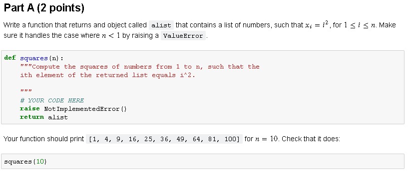
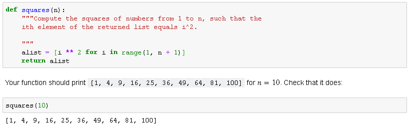
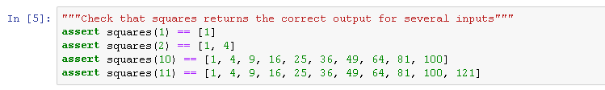
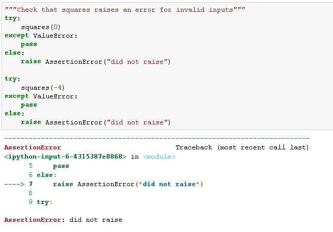

# How to do your python homework

For the following lectures in "Python Crash Course" we will use jupyter notebook. 

Here is the workflow:
1) `cd` to the folder holding your `.ipynb` files you want to work on.

`cd path/to/my/homework`

2) Activate the anaconda environment we want to work in.  You can think of the "environment" as a sandbox for python, where only the things you want for a specific project are available, and nothing else. For most tasks, you will create a specific conda environment and activate it. In this case we will just be using the `base` environment.

`conda activate base`

3) Then run jupyter notebook:

`jupyter notebook`

You should now be forwarded to a webpage showing the jupyter notebook interface. 

4) Open the homework assignment for the week. 

5) Change the name of the .ipynb file following the directions at the top of the file.

6) Enter your name and any students you collaborated with in the top cell


 
7) Fill your answers in the section starting with `# YOUR CODE HERE`

This will require you to *remove* the following code snippet:

```
# YOUR CODE HERE
raise NotImplementedError()
```

If you leave `raise NotImplementedError()` you might loose points. 

# General Approach

There will be a series of questions, some of which will be autograded and others that will be manually graded. 

A question will take the following form. I will provide a specific prompt. 


In the example above you need to write code to generate an object called `alist`. Then `alist` gets returns from the function to the autograder. 

DO NOT DELETE `return alist`, or if you do, add it back.

## Correct Answers
In this example we will write a bit of code that will correctly answers the question.  



Note that running the function `squares(10)` provides to desired outcome. 

This answer is validated by the autograder with a series of `assert` tests.  If your answer is 100% correct, you should not throw any error when the assertion tests are run. 

The following assertion tests were completed without throwing any errors. This is what we want!



## Incorrect Answers

For this question there is another cell with assertion tests that will fail in this case. Here the tests are trying to see if you are handling invalid inputs from the user. For instance setting n=0 or n=-1 should throw an errror. 



Here the assertion tests are pointing out that we allowed invalid inputs! We should go back to our code and fix it until we are no longer getting errors from this cell of tests. 

# Autograder Tips
The objective is to: 
- Run Cell > Run All, without any errors

How do we do it:
- `return` the object requested in the prompt
- make sure your object is exactly as requested

Tricks:
- You can always add more cells to experiment in, just make sure you put your final answer in the correct place, and *delete* any cells that you don't need in the end. 
- You can always print an object to the screen `print(an_object_name)`, or look at its type `print(type(an_object_name))`

